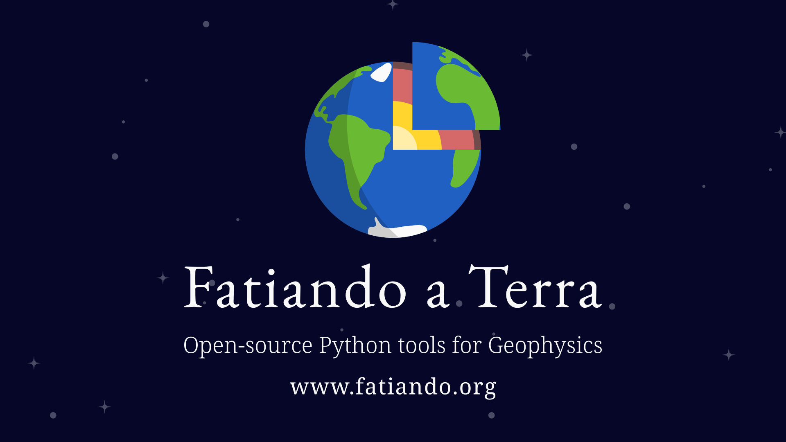

# Fatiando a Terra: software libre para geofísica

## Abstract



Fatiando a Terra es un proyecto comunitario que posee el objetivo de
desarrollar herramientas de software libre para geofísica que sean sencillas de
utilizar y cuenten con extensiva documentación.
Fatiando consiste actualmente en una colección de librerías de Python que
permiten realizar diversas tareas, desde descargar y almacenar datos de la web,
procesar en interpolar datos espaciales, hasta modelar y procesar datos de
métodos potenciales, tales como gravimétricos y magnéticos.
El proyecto se desarrolla de manera colaborativa gracias a una comunidad
internacional de desarrolladores, muches de los cuales utilizan sus
herramientas diariamente en sus investigaciones o en sus aplicaciones en la
industria.
Durante esta charla se expondrán las principales herramientas del proyecto,
mostrando mediante ejemplos sus capacidades y cómo pueden ser utilizadas para
resolver distintos problemas geofísicos y geológicos.

## Bio


Santiago Soler es Licenciado en Física (UNR) y Doctor en Geofísica (UNSJ).
Durante su doctorado investigó nuevas metodologías para el procesamiento
y modelado de datos gravimétricos y magnéticos.
En paralelo a su investigación, Santiago forma parte del grupo de
desarrolladores de Fatiando a Terra, un proyecto cuyo objetivo es generar
herramientas de software libre para geofísica.
Actualmente, Santiago se encuentra realizando una postdoc en la Universidad de
British Columbia (Canadá), aplicando inversiones conjuntas de gravedad
y magnetismo a fin de caracterizar el potencial de rocas ultramáficas para
secuestrar y mineralizar carbono.


## Cómo correr los notebooks

En la carpeta `notebooks` de este repositorio se encuentran los Jupyter
Notebooks que se utilizaron durante la charla.

Para poder correrlos es necesario que instalemos una distribución de Python
como [Anaconda](https://www.anaconda.org)
o [Mambaforge](https://github.com/conda-forge/miniforge#mambaforge).

> Recomendamos Mambaforge por sobre Anaconda o Miniconda, ya que viene
> configurado para utilizar `mamba`, un gestor de paquetes más rápido que
> `conda`.

Luego, debemos descargar este repositorio. Si poseemos `git` instalado en
nuestro sistema, podemos clonar el repositorio a nuestra computadora con:

```bash
git clone https://www.github.com/santisoler/2023-fatiando-igeba
```

O bien, [descargarlo como un archivo
`.zip`](https://github.com/santisoler/2023-fatiando-igeba/archive/refs/heads/main.zip).

En una terminal, nos movemos al directorio del repositorio:

```bash
cd 2023-fatiando-igeba
```

Y vamos a crear el _environment_ con todos los paquetes de Python que
necesitamos:

```bash
mamba env create -f environment.yml
```

Una vez hecho esto, vamos a ejecutar `jupyter-lab`:

```bash
jupyter-lab
```

JupyterLab nos abrirá una pestaña en nuestro navegador. En el panel de la
izquierda vamos a poder ver los archivos de este repositorio. En a la
carpeta `notebooks`, vamos a hallar los notebooks utilizados en esta charla.
Haciendo doble click en cualquiera de ellos vamos a poder abrirlos.

Para ejecutar una celda de un notebook debemos pararnos y presionar
`Shift+Enter`, o bien hacer click en el símbolo ⏵.


## Licencia

El contenido de esta presentación se encuentra disponible bajo la
[Licencia Creative Commons Atribución 4.0 Internacional][cc-by].

[![CC BY 4.0][cc-by-image]][cc-by]

[cc-by]: https://creativecommons.org/licenses/by/4.0/deed.es
[cc-by-image]: https://i.creativecommons.org/l/by/4.0/88x31.png
