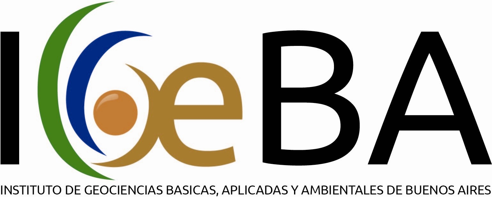
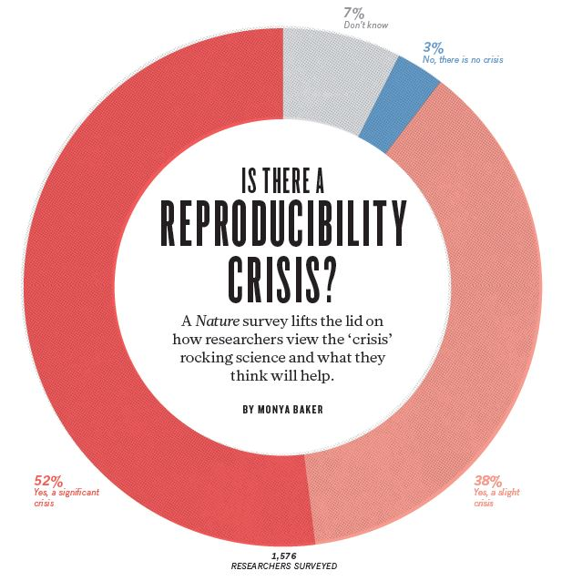
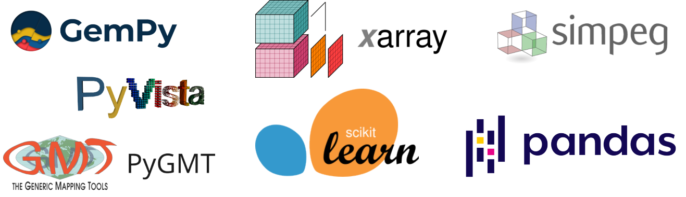

<!-- .slide: class="slide-title" data-background-image="images/fatiando-background.png" -->

<h1 class="title"> Fatiando a Terra:   software libre para geofísica </h1>
<h2 class="authors"><a href="https://www.santisoler.com">Santiago Soler</a></h2>

IGeBA  |  Abril 2023

<i class="fa-solid fa-earth-americas"></i>
<a href="https://www.fatiando.org">fatiando.org</a>
|
<i class="fab fa-creative-commons"></i><i class="fab fa-creative-commons-by"></i>
Creative Commons Attribution 4.0

---

<!-- .slide: data-visibility="hidden" -->

## Layout

- acerca de mi
    - lic fisica en unr
    - phd en unsj
    - postdoc en ubc (ahora)
- que es software libre/open-source?
- por que usar sl en ciencia?
    - ciencia abierta
    - reproducibilidad
    - accesibilidad/democratizacion de la ciencia
    - avances sobre desarrollos anteriores (no reinventar la rueda)
    - favorece la colaboracion
- que es fatiando?
    - historia
    - herramientas actuales
- ejemplos con verde
    - data decimation
    - detrend
    - gridding/interpolation
- ejemplos con harmonica
    - processing gravity data
- cerrando
    - como se desarrolla fatiando (comunidad, colaboracion)
    - quienes desarrollan fatiando
    - quienes lo usan?
    - join the conversation

## dont forget to mention

- doctorado en unsj, donde comencé a colaborar con fatiando
- otros software libres en geofisica (python stack, gmt, qgis, gplates)
- integracion con otros software: pyproj, pygmt, etc
- awesome open geoscience: https://github.com/softwareunderground/awesome-open-geoscience

---

# Acerca de

<ul class="fa-ul">
    <li><i class="fa-li fa-sharp fa-solid fa-building-columns"></i>
        Lic en Física (UNR)
    </li>
    <li><i class="fa-li fa-sharp fa-solid fa-building-columns"></i>
        Doctor en Geofísica (UNSJ)
    </li>
    <li><i class="fa-li fa-sharp fa-solid fa-building-columns"></i>
        Postdoc en UBC, Canada
    </li>
    <li><i class="fa-li fas fa-flask"></i>
        Investigaciones:
    </li>
        <ul class="margin-left-0">
            <li class="text-medium">Procesamiento y modelado gravedad y magnetismo</li>
            <li class="text-medium">Inversiones conjuntas</li>
        </ul>
    <li><i class="fa-li fas fa-code"></i>
        Desarrollador de Fatiando a Terra 🌎
    </li>
</ul>

---

<!-- .slide: class="center"  -->

# ¿Qué es el software libre   u open-source?

---

<!-- .slide: class="center"  -->

## Libertades

0. <b class="green">Utilizar</b> el software con cualquier propósito
1. <b class="green">Estudiar</b> el código y <b class="green">modificarlo</b>
2. <b class="green">Distribuir copias</b> del software
3. <b class="green">Distribuir</b> versiones <b class="green">modificadas</b>

---

<!-- .slide: class="center" data-background-color="#eee" -->

## Ejemplos

Licencia: LGPLv3

Licencia: GPLv2

Licencia: BSD-Clause3

---

<!-- .slide: class="center"  -->

# ¿Por qué utilizar software libre en Ciencia?

---

Baker, M. (2016). doi: [10.1038/533452a](https://doi.org/10.1038/533452a)

---

[PhDComics (2014-03-14)](https://phdcomics.com/comics/archive.php?comicid=1689)

---

<!-- .slide: class="center"  -->

## El software libre:

- Posibilita una **Ciencia Abierta**
- Aumenta a la **reproducibilidad**
- **Democratiza** la Ciencia
- Facilita **desarrollos futuros**
- Favorece la **colaboración**

---

<!-- .slide: data-background-image="images/fatiando-banner.png" data-background-size="contain" data-background-color="#060629" -->

---

<!-- .slide: class="center" data-background-image="images/fatiando-background.png" -->

## Un poco de historia

- Comenzó en 2010
- Parte del Doctorado de **Leonardo Uieda** en Brasil
- Librería de Python: `fatiando`
- Herramientas para:
    - Procesar datos espaciales
    - Modelado de gravedad y magnetismo
    - Inversiones geométricas
    - Problemas juguete para docencia
- Circa 2015: primeras colaboraciones de Santiago

---

<!-- .slide: class="center" data-background-image="images/fatiando-background.png" -->

## Modernizar nuestras herramientas

+

Ecosistema científico   en Python

---

<!-- .slide: class="center" data-background-image="images/fatiando-background.png" -->

## ✨🌎 Librerías de Fatiando 🌎✨

---

<!-- .slide: class="center" data-background-color="#eeeeee" -->

<!-- row 1 -->

<!-- Verde -->

**Procesamiento** e **interpolación** de datos espaciales
con un toque de machine learning

<i class="fab fa-github fa-fw" title="Github repository"></i>
<a href="https://github.com/fatiando/verde">fatiando/verde</a>

<!-- - -->

<!-- Harmonica -->

Procesamiento y modelado de **gravedad** y **magnetismo**

<i class="fab fa-github fa-fw" title="Github repository"></i>
<a href="https://github.com/fatiando/harmonica">fatiando/harmonica</a>

<!-- - -->

<!-- row 2 -->

<!-- Boule -->

**Elipsoides de referencia** y cálculo de **gravedad normal**

<i class="fab fa-github fa-fw" title="Github repository"></i>
<a href="https://github.com/fatiando/boule">fatiando/boule</a>

<!-- - -->

<!-- Pooch -->

**Descarga** y **almacena** datos de la web

<i class="fab fa-github fa-fw" title="Github repository"></i>
<a href="https://github.com/fatiando/pooch">fatiando/pooch</a>

<!-- - -->

<!-- Ensaio -->

Sets de **datos geofísicos** bajo **licencia abierta** para experimentar

<i class="fab fa-github fa-fw" title="Github repository"></i>
<a href="https://github.com/fatiando/ensaio">fatiando/ensaio</a>

<!-- - -->

---

<!-- .slide: class="center" data-background-image="images/demo-time.gif" -->

<h1 style="text-shadow: 3px 3px 5px black;" >
Demos!
</h1>

---

<!-- .slide: class="center"  -->

## Descargá los Notebooks

<i class="fa fab fa-github" style="margin-top: 1em;"></i>
<a href="https://github.com/santisoler/2023-fatiando-igeba">
github.com/santisoler/2023-fatiando-igeba
</a>

---

<!-- .slide: class="center" data-background-image="images/fatiando-background.png" -->

# ¿Quién utiliza Fatiando?

---

<!-- .slide: data-background-image="images/fatiando-papers.png" data-background-size="contain" -->

---

<!-- .slide: class="center" data-background-image="images/fatiando-background.png" -->

# ¿Quién desarrolla Fatiando?

---

<!-- .slide: class="center slide-steering-council" data-background-image="images/fatiando-background.png" -->

## Steering council

<i class="fab fa-github fa-fw"></i>
<a href="https://github.com/aguspesce">aguspesce</a>

<i class="fab fa-github fa-fw"></i>
<a href="https://github.com/leouieda">leouieda</a>

<i class="fab fa-github fa-fw"></i>
<a href="https://github.com/ll-geo">LL-Geo</a>

<i class="fab fa-github fa-fw"></i>
<a href="https://github.com/mgomezn">MGomezN</a>

<i class="fab fa-github fa-fw"></i>
<a href="https://github.com/santisoler">santisoler</a>

---

<!-- .slide: class="center slide-contributors" data-background-image="images/fatiando-background.png" -->

## Contribuidores

---

<!-- .slide: class="center slide-community" data-background-image="images/fatiando-background.png" -->

# ¡Participa en la comunidad!

<i class="fas fa-book"></i>
Aprende a usar las herramientas
<a href="https://www.fatiando.org/learn">fatiando.org/learn</a>

<i class="fas fa-comments"></i>
Contactate con el resto de la comunidad
<a href="https://www.fatiando.org/contact">fatiando.org/contact</a>

---

<!-- .slide: class="center" -->

# ¡Gracias!

---

<!-- .slide: class="center" -->

## Contacto

<ul class="fa-ul">
<li>
<i class="fa-li fas fa-globe"></i>
<a href="https://www.fatiando.org">fatiando.org/contact</a>
</li>
<li>
<i class="fa-li fas fa-globe"></i>
<a href="https://www.santisoler.com">santisoler.com</a>
</li>
<li>
<i class="fa-li fab fa-mastodon"></i>
<a href="https://scicomm.xyz/@santisoler">@santisoler@scicomm.xyz</a>
</li>
<li>
<i class="fa-li fab fa-github"></i>
<a href="https://www.github.com/santisoler">santisoler</a>
</li>
</ul>

Diapositivas disponibles en
[santisoler.com/2023-fatiando-igeba](https://www.santisoler.com/2023-fatiando-igeba)

<i class="fab fa-creative-commons"></i><i class="fab fa-creative-commons-by"></i>
Creative Commons Attribution 4.0

